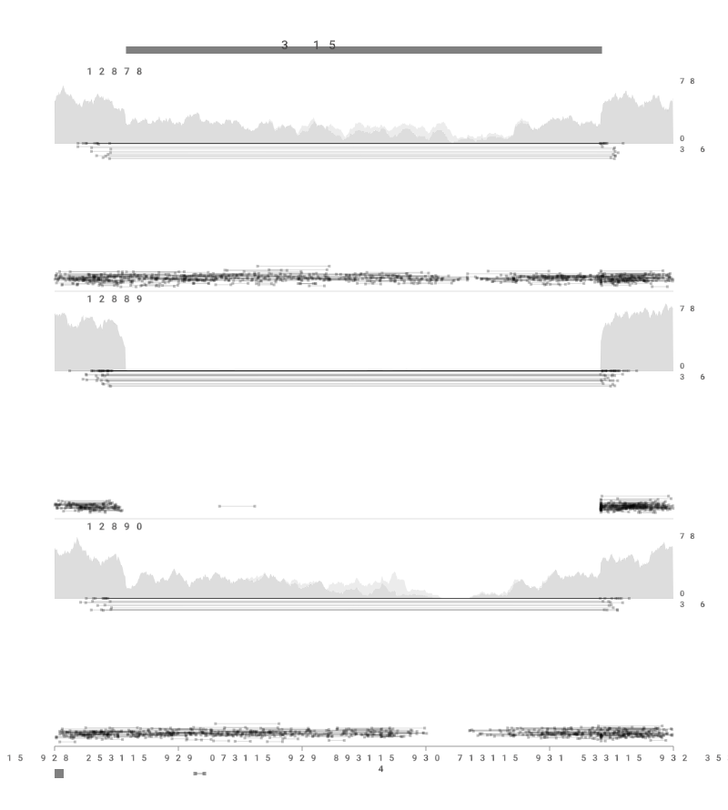
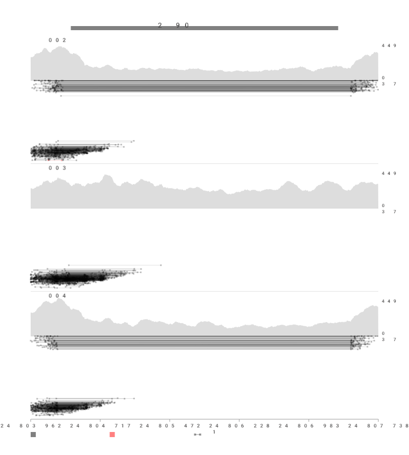
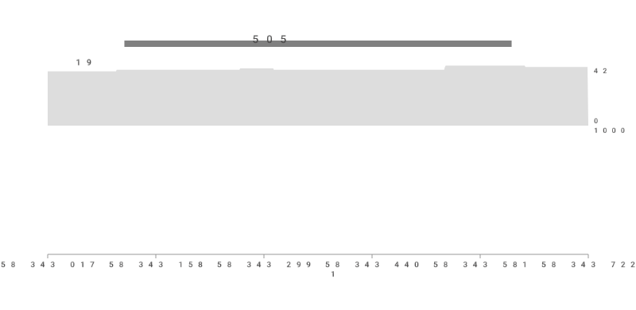
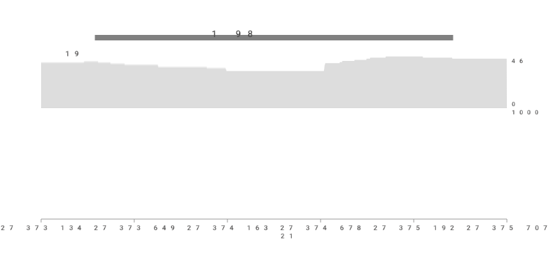

# svplot-js

[](https://github.com/jlanej/svplot-js/actions/workflows/ci.yml)

> **⚠️ IMPORTANT: This is NOT samplot. This is an AI-generated prototype.**
>
> This project was created with AI assistance as an experimental attempt to bring [samplot](https://github.com/ryanlayer/samplot)-style structural variant visualization to the browser. **It is a proof-of-concept and should not be mistaken for, or used in place of, the original [samplot](https://github.com/ryanlayer/samplot).**
>
> **For production use, research, and publications, please use and cite the original samplot:**
>
> - **Repository:** <https://github.com/ryanlayer/samplot>
> - **Citation:** Belyeu, J.R., Nicholas, T.J., Pedersen, B.S. et al. SV-plaudit: A cloud-based framework for manually curating thousands of structural variants. *GigaScience*, 7(7), 2018.
>
> All credit for the original samplot concept, design, and implementation belongs to [Ryan Layer](https://github.com/ryanlayer) and the samplot contributors.

---

Browser-based interactive structural variant visualization, inspired by [samplot](https://github.com/ryanlayer/samplot).

This prototype reads indexed BAM files directly in the browser and renders samplot-style visualizations on an HTML5 Canvas — no server-side processing required.

## Example Output

These images are automatically generated from real BAM data on every commit via CI.

### Deletion — chr4 (NA12878 / NA12889 / NA12890)



### Deletion — chr1 trio (HG002 / HG003 / HG004)



### Deletion — chr1 (hg19 long-read)



### Inversion — chr21 (hg19 long-read)



## Features

- **Browser-native BAM reading** via [@gmod/bam](https://github.com/GMOD/bam-js)
- **Canvas rendering** matching Python samplot's visual style
- Coverage tracks with high/low mapping quality separation
- Paired-end read visualization colored by event type (DEL/DUP/INV)
- Split-read visualization
- Variant bar with SV size annotation
- Interactive navigation (zoom, pan)
- Support for remote BAM URLs and local file selection
- Multi-sample display

## Quick Start

### Using the UMD bundle

```html
<div id="samplot-container" style="width:800px;"></div>
<script src="samplot.js"></script>
<script>
  const viewer = new Samplot({
    container: '#samplot-container',
    samples: [
      { url: '/data/NA12878.bam', label: 'NA12878' },
      { url: '/data/NA12889.bam', label: 'NA12889' },
      { url: '/data/NA12890.bam', label: 'NA12890' },
    ],
    chrom: 'chr4',
    start: 115928726,
    end: 115931880,
    svType: 'DEL',
  });
  viewer.plot();
</script>
```

### Using ES modules

```javascript
import Samplot from 'samplot-js';

const viewer = new Samplot({
  container: document.getElementById('my-container'),
  samples: [
    { url: 'https://example.com/sample.bam', label: 'Sample 1' },
  ],
  chrom: 'chr4',
  start: 115928726,
  end: 115931880,
  svType: 'DEL',
});

await viewer.plot();
```

### Using local files

```javascript
const viewer = new Samplot({
  container: '#container',
  samples: [
    {
      bamFile: bamFileObject,      // File from <input type="file">
      indexFile: baiFileObject,    // Corresponding .bai file
      label: 'My Sample',
    },
  ],
  chrom: 'chr4',
  start: 115928726,
  end: 115931880,
  svType: 'DEL',
});

await viewer.plot();
```

## API

### `new Samplot(config)`

| Option | Type | Default | Description |
|--------|------|---------|-------------|
| `container` | `string \| HTMLElement` | required | CSS selector or DOM element |
| `samples` | `Array<Object>` | required | Sample configurations (see below) |
| `chrom` | `string` | required | Chromosome name |
| `start` | `number` | required | SV start position |
| `end` | `number` | required | SV end position |
| `svType` | `string` | `undefined` | SV type: `'DEL'`, `'DUP'`, `'INV'` |
| `window` | `number` | `0.15` | Fraction of SV size to pad the viewing window |
| `maxDepth` | `number` | `1000` | Maximum number of reads to display |
| `minMappingQuality` | `number` | `1` | Minimum mapping quality filter |
| `separateMappingQuality` | `number` | `20` | MAPQ threshold for coverage coloring |

#### Sample configuration

Each sample object accepts either remote URLs or local File objects:

```javascript
// Remote BAM
{ url: 'https://...bam', indexUrl: 'https://...bam.bai', label: 'Name' }

// Local files
{ bamFile: File, indexFile: File, label: 'Name' }
```

### `samplot.plot(options?)`

Fetch reads and render the plot. Returns a `Promise<void>`.

Optional `options` can override `chrom`, `start`, `end`, `svType`.

### `samplot.navigate(chrom, start, end, svType?)`

Navigate to a new region (refetches data).

### `samplot.getData()`

Returns the processed sample data for programmatic access.

### `samplot.destroy()`

Clean up the instance and remove the canvas.

## Visual Elements

The visualization matches Python samplot's output:

| Element | Style | Color |
|---------|-------|-------|
| **Paired-end reads** | Solid line with square markers | Black (Del/Normal), Red (Dup), Blue (Inv) |
| **Split reads** | Dotted line with circle markers | Same as paired-end |
| **Coverage (high MAPQ)** | Filled area | Dark grey, alpha 0.4 |
| **Coverage (low MAPQ)** | Filled area (stacked) | Light grey, alpha 0.15 |
| **Variant bar** | Thick horizontal line | Black, alpha 0.5 |

## Development

```bash
# Install dependencies
cd svplot-js && npm install

# Run tests
npm test

# Build UMD bundle
npm run build

# Development build (unminified)
npm run build:dev

# Generate example images (saved to examples/images/)
npm run generate-examples
```

## Architecture

```
svplot-js/src/
├── index.js          # Main Samplot class and public API
├── bam-reader.js     # BAM file reading via @gmod/bam
├── data-processor.js # Read classification and coverage computation
├── renderer.js       # Canvas-based rendering engine
├── constants.js      # Colors, defaults, flag constants
└── utils.js          # Coordinate mapping and formatting utilities
```

## Comparison with Python samplot

> **Reminder:** This is an AI-generated prototype, not a replacement for samplot. For production use, please visit <https://github.com/ryanlayer/samplot>.

This JavaScript prototype focuses on **short-read WGS** visualization. The following features from Python samplot are partially replicated:

- ✅ Multi-sample BAM visualization
- ✅ Paired-end read display with event type coloring
- ✅ Split-read display
- ✅ Coverage tracks (stacked high/low quality)
- ✅ Variant bar with size annotation
- ✅ Coordinate axes and legends

Features not yet ported:
- ❌ Long-read visualization (PacBio, ONT)
- ❌ Linked-read (10X) visualization
- ❌ Annotation tracks (BED, GFF)
- ❌ Transcript tracks
- ❌ CRAM file support
- ❌ VCF batch processing

## Acknowledgements & Citation

This project is an **AI-generated prototype** inspired entirely by [**samplot**](https://github.com/ryanlayer/samplot) by Ryan Layer and contributors. All credit for the original concept, algorithms, and visual design belongs to the samplot team.

**If you are a researcher or developer looking for a production-ready structural variant visualization tool, please use and cite samplot:**

> Belyeu, J.R., Nicholas, T.J., Pedersen, B.S. et al. SV-plaudit: A cloud-based framework for manually curating thousands of structural variants. *GigaScience*, 7(7), 2018.
>
> GitHub: <https://github.com/ryanlayer/samplot>

This prototype is not affiliated with, endorsed by, or a replacement for samplot. It is an experimental, AI-assisted exploration of bringing samplot-style visualizations to the browser.

## License

MIT — see [LICENSE](LICENSE)
